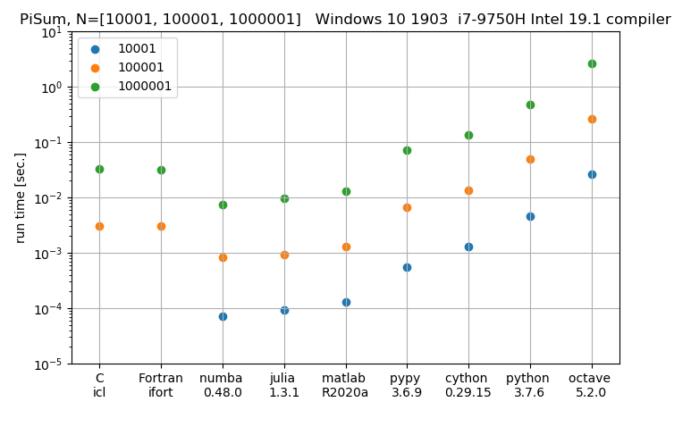
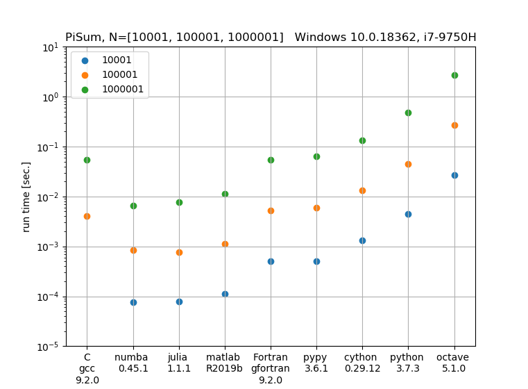
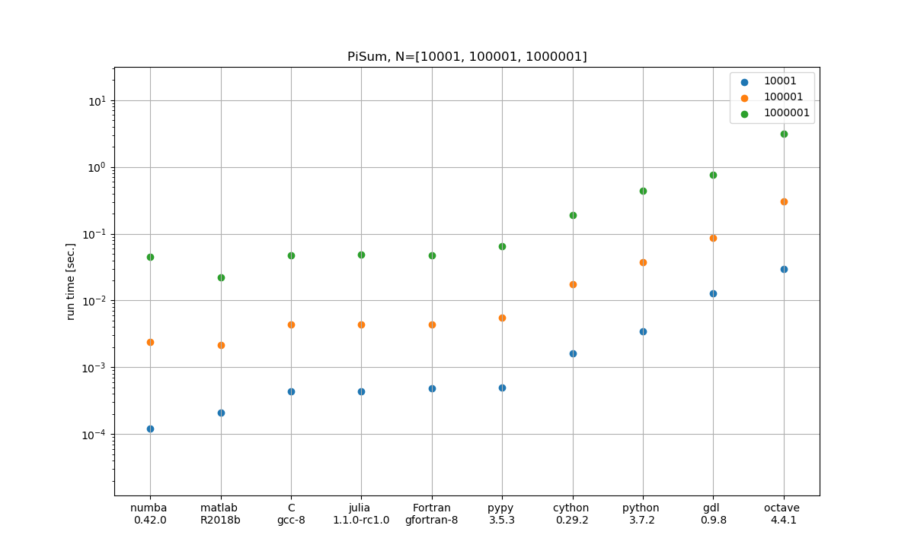

# Python Performance


All benchmarks are platform-independent (run on any computing device with appropriate hardware).
CuPy tests require an NVIDIA GPU with CUDA toolkit installed.

## Install

This command prepares Python prereqs:

```sh
pip install -e .
```

Using the C and/or Fortran tests requires compilation using CMake.

```sh
cmake -B build

cmake --build build

cd build

ctest
```

## Usage

Iterative benchmarks, here using the pisum algorithm:

```sh
python Pisum.py
```







Matrix Multiplication benchmarks:

    python Matmul.py

### Hypotenuse

Observe that `hypot()` is faster from 1 to a few hundred elements, then
sqrt(x^2+y^2) becomes slightly faster. However, `hypot()` does not
overflow for arguments near REALMAX. For example, in Python:

```python
from math import sqrt, hypot

a=1e154; hypot(a,a); sqrt(a**2+a**2);

1.414213562373095e+154
inf
```

Execute the Hypot speed test by:

    ./RunHypot.py


## Notes

### Julia

Julia binaries are often downloaded to a particular directory.
Python doesn't pickup `.bash_aliases`, which is commonly used to point to Julia.

### MKL selection

https://software.intel.com/en-us/articles/intel-mkl-link-line-advisor

We give a hint to CMake where your MKL libraries on.
For example:
```sh
MKLROOT=/opt/intel/mkl cmake ..
```
Of course this option can be combined with `FC`.

You can set this environment variable permanently for your convenience
(normally you always want to use MKL) by adding to your `~/.bashrc` the
line:
```sh
export MKLROOT=/opt/intel/mkl
```
